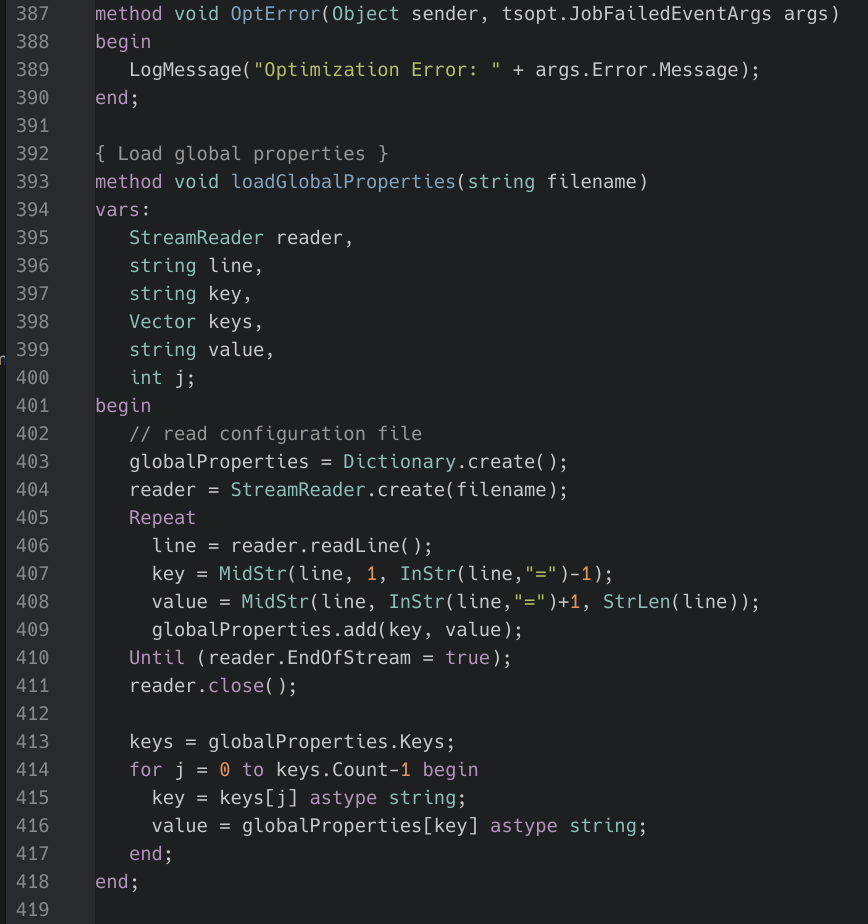

# OneDark easylanguage-syntax theme for Atom

## Grammar Processing and Syntax Highlighting

Primary syntax highlight for [**Easylanguage**](en.wikipedia.org/wiki/EasyLanguage). Default for files with file-extension `*.eld`. Or press `ctrl+shift+l` and select easylanguage.

Grammer Language Processing is separate project, because the source highlighting can be different by selected atom colorscheme.

Install a grammar atom package [`raven2cz/atom-language-easylanguage`](https://github.com/raven2cz/atom-language-easylanguage) which contains ELD grammar.

**See example of highlighting possibilities**

